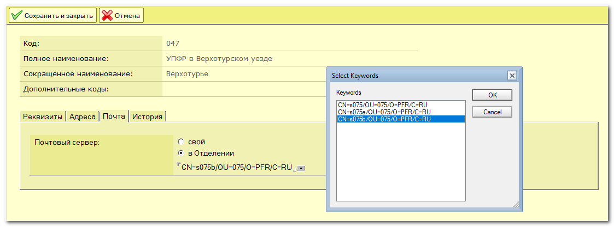
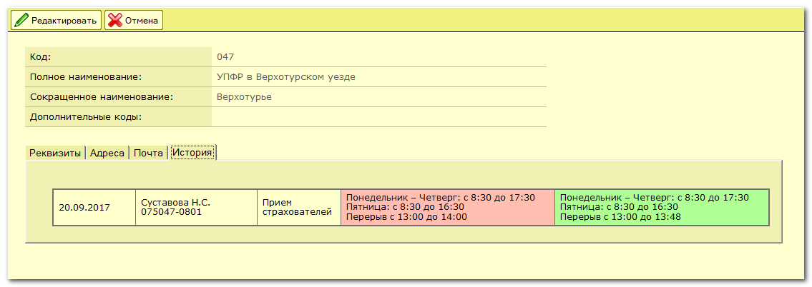

# Lotus Notes

Я Алексей Шихов, программист Lotus Notes. Ниже пример некоторых моих разработок.

## Кадры

Приложение для учета сотрудников предприятия. Хранится история изменений, автоматически создаются учетные записи в Active Directory, в почте, добавляются в группы и т.д. Также информация из этой базы широко используется в других приложениях.

Примеры справочников.

Автоматически формируемые группы. Условие отбора можно задать как непосредственным выбором отделов и должностей, так и запросом на языке формул

На основе данных из базы формируется телефонный справочник в формате HTML

## Запросы

Приложение для сбора различной информации от управлений

Пример запроса

Заполнение ответа со стороны пользователя

Экспорт ответов в формат CSV

Настройки

## Серверы

Приложения для учета серверов и другого оборудования

Карточка сервера

Учетные записи, связанные с сервером. Можно быстро скопировать в буфер обмена имя пользователя, пароль и др.

Журнал изменений документа

Учет IP-адресов

В базу также попадают уведомления от серверов

Переадресация сообщений от системы мониторинга Zabbix

## Задачи

Небольшое приложение для постановки задач

Пример задачи. Можно вести обсуждения в комментариях

Настройки. Уведомления обо всех событиях можно получать на почту и в Телеграм. Также прямо в Телеграме можно отвечать на комментарии, для чего написан небольшой бот на Java.

## Компьютеры

Приложение для учета компьютеров. Синхронизируется с Active Directory, привязывается к пользователю, обновляет информацию о железе

## Мелочи

Приложения для отслеживания новых документов в разных базах (конференции и любые другие)

Простой файлообменник

